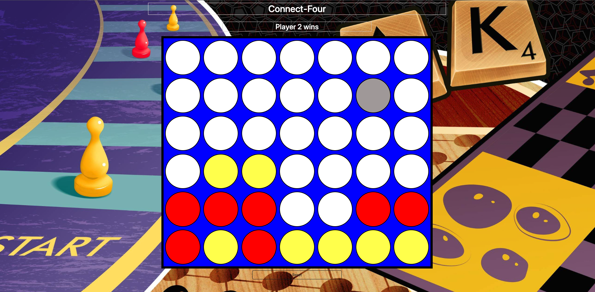

# Connect-Four
## ReadMe

Connect Four is a game setup with a board containing 7 columns and 6 rows. The objects used in this two-player game are 42 circular pieces. The pieces are differentiated by two solid colors and are divided evenly between the players. The players take turns dropping a single piece from the top of the board to its lowest available space. The first player to connect four of their pieces together wins the game. Players can win by connecting their pieces vertically, horizontally, or diagonally.

### Getting started

https://cmems-connect-four.netlify.app/

### Instructions
- The first person to choose a spot is player one
- Each player can only go once
- Each piece will fall to the lowest available spot
- If the spot is taken, the piece will stack on top of the other
- The players can see who’s turn it is at the top of the board game
- The first person to connect four of their pieces will win the game
- If no player is able to connect four of their pieces and there are no empty spaces left, the game will be rendered as a tie. Play again!

### Technologies used
- HTML, CSS, JavaScript, Bootstrap

### Next Steps
- Add a scoreboard to display the win count
- Add a mode to play against computer
- Add an outline to show where a player has connected four of their pieces
- Have the winning combination rotate

### Credits
- Clipart Library (Favicon)
- WallpaperAccess (Background Image)
- mixkit (Audio)